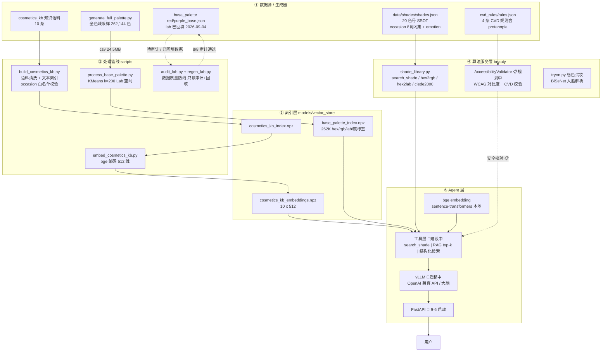

# ColorBoundless 工程数据流 DAG

> 生成于 2026-09-04。所有边基于仓库实物核对；规划中/建设中的节点已标注，未实现的不画成已实现。
> 状态标记：✅ 已实现 | 🔨 建设中 | 📋 规划中

## 一、Mermaid 源码（推荐：粘贴到 mermaid.live 一键出图）



## 二、纯文字 + 箭头版（喂给图像 AI 用）

```
【第 1 层：数据源与生成器】
  [generate_full_palette.py] ──262,144色 csv(24.5MB)──▶ [full_palette.csv]
  [data/shades/shades.json]        （20 色号，场合闭集+风格词，SSOT 正本）
  [cosmetics_kb 语料]              （10 条知识条目）
  [base_palette red/purple.json]   （色号属性，lab 已脚本回填）
  [cvd_rules/rules.json]           （4 条色盲规则）

【第 2 层：处理管线】
  [full_palette.csv] ──KMeans k=200(Lab空间)──▶ [base_palette_index.npz]
  [cosmetics_kb 语料] ──清洗+校验──▶ [cosmetics_kb_index.npz] ──bge 512维──▶ [cosmetics_kb_embeddings.npz]
  [audit_lab.py] ──只读审计──▶ (red/purple_base.json 质检报告)
  [regen_lab.py] ──按 hex 重算回写──▶ (red/purple_base.json)

【第 3 层：索引与 SSOT（模型的"记忆"）】
  base_palette_index.npz   = 262K 色结构化检索
  cosmetics_kb_embeddings.npz = RAG 知识向量
  shades.json              = 色号查询正本

【第 4 层：算法服务】
  [shade_library.py] ◀──加载── [shades.json]
      提供: search_shade / hex2rgb / hex2lab / ciede2000
  [cvd_rules/rules.json] ──▶ [AccessibilityValidator(规划中)]
  [BiSeNet 人脸解析] ──▶ [tryon.py 唇色试妆]

【第 5 层：Agent 层（建设中）】
  [bge 本地编码] ──query 向量──▶ [工具层]
  [base_palette_index.npz] ──筛选+簇内CIEDE2000──▶ [工具层]
  [cosmetics_kb_embeddings.npz] ──内积 top-k──▶ [工具层]
  [shade_library.search_shade] ──函数调用──▶ [工具层]
  [工具层] ──工具结果──▶ [vLLM 大脑] ──自然语言──▶ [FastAPI] ──▶ [用户]
```

## 三、给图像 AI 的生成指令（直接复制）

> 请绘制一张自上而下的软件架构数据流图，共 5 层，使用圆角矩形节点、实线箭头表示数据流、虚线箭头表示质量控制流。
> 第 1 层（数据源，浅蓝）：5 个节点——generate_full_palette 脚本、shades.json、cosmetics_kb 语料、base_palette JSON、cvd_rules JSON。
> 第 2 层（处理管线，浅绿）：4 个节点——build_cosmetics_kb、embed_cosmetics_kb、process_base_palette(KMeans)、audit/regen_lab。
> 第 3 层（索引层，浅黄）：3 个节点——base_palette_index.npz(262K)、cosmetics_kb_embeddings.npz(512维)、shades.json SSOT。
> 第 4 层（算法服务，浅橙）：3 个节点——shade_library(色差计算)、AccessibilityValidator(虚线，规划中)、tryon 试妆。
> 第 5 层（Agent 层，浅红）：4 个节点——bge 编码、工具层、vLLM 大脑、FastAPI，最右侧一个"用户"节点。
> 关键边：csv→KMeans→npz；语料→文本索引→向量；shades.json→shade_library；三个检索源→工具层→vLLM→FastAPI→用户。
> 中文标签，技术栈名称用等宽字体标注在节点内。

## 四、边清单（人工核对用，全部基于实物）

| # | 从 | 边上是 | 到 | 状态 |
|---|---|---|---|---|
| 1 | generate_full_palette.py | 262,144 色 CSV（脚本公式 lab） | data/processed/base_palette/full_palette.csv | ✅ |
| 2 | full_palette.csv | 24.5MB 表格 | process_base_palette.py | ✅ |
| 3 | process_base_palette.py | hex/rgb/lab/簇标签数组 | base_palette_index.npz | ✅ |
| 4 | cosmetics_kb 语料 | 10 条文本 | build_cosmetics_kb.py（occasion 白名单校验） | ✅ |
| 5 | cosmetics_kb_index.npz | 检索文本 | embed_cosmetics_kb.py（bge） | ✅ |
| 6 | embed_cosmetics_kb.py | (10, 512) float32 | cosmetics_kb_embeddings.npz | ✅ |
| 7 | shades.json | 20 色号 | shade_library.py（模块级加载，SSOT） | ✅ |
| 8 | audit_lab.py | 8/8 审计报告 | base_palette/*.json（只读） | ✅ |
| 9 | regen_lab.py | hex2lab 重算回填 | base_palette/*.json（写） | ✅ |
| 10 | cvd_rules/rules.json | 4 条规则 | AccessibilityValidator | 📋 规划中 |
| 11 | cvd_matrix.py | CVD 模拟矩阵 | 规则验证/测试 | ✅ |
| 12 | 三个检索源 + search_shade | 工具结果 | 工具层 → vLLM | 🔨 建设中 |
| 13 | vLLM | OpenAI 兼容 API | FastAPI → 用户 | 🔨 建设中 |

## 五、两条铁律（画完图也成立）

1. **结构化检索和向量检索不混**：262K 色匹配走 KMeans+Lab（npz），知识问答走 bge 向量（npz）——两条管线，两把武器；
2. **数据正本只有一份**：shades.json 是色号正本、base_palette JSON 经审计回填——能算出来的值不手写，手写了必须有 audit。
